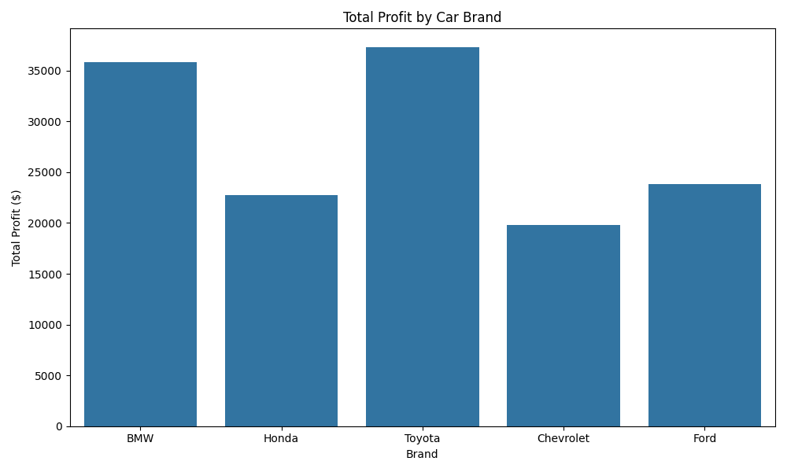
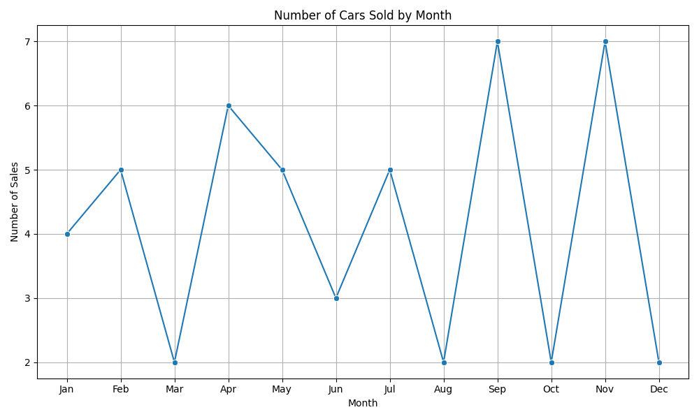
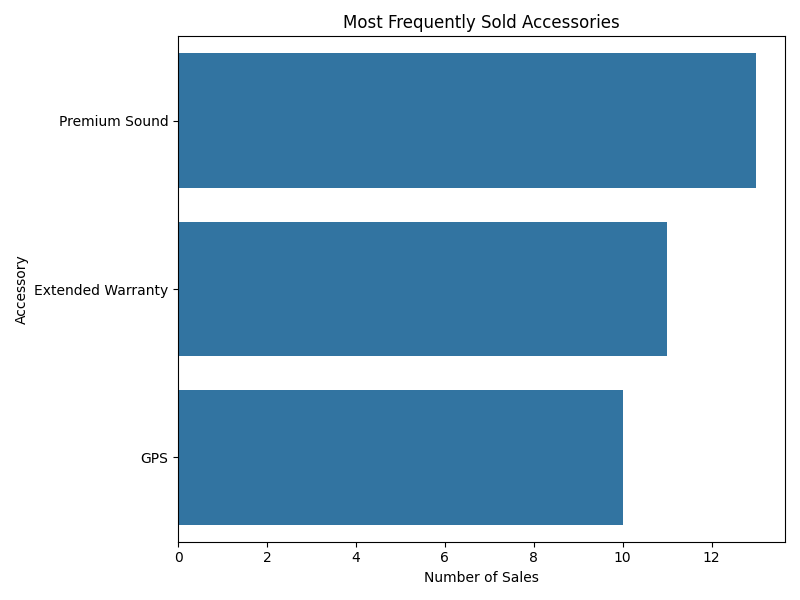

# 🚗 Car Sales Data Analysis

This project explores a fictional car dealership dataset to uncover insights in brand profitability, sales trends, and accessory popularity.

---

## 📊 Key Questions Answered
- Which car brand generated the most profit?
- When do most car sales happen?
- What accessories are most frequently upsold?

---

## 🛠️ Tools Used
- Python (Pandas, Seaborn, Matplotlib)
- Data Cleaning & Aggregation
- Data Visualization
- Basic EDA (Exploratory Data Analysis)

---

## 📈 Visualizations

### 💰 Profit by Brand

### 📅 Monthly Sales Trend

### 🎧 Accessory Popularity

---

## 💡 Summary Insights
- BMW and Toyota generated the highest total profits
- Most sales occur in **June and July**
- “Extended Warranty” and “Premium Sound” are the most upsold accessories

---

## 📁 Dataset
- File: `car_sales_data.csv`
- Records: 50 rows of mock data
- Columns: Brand, Model, Year, Sale Price, Profit, Accessory, Sale Month

---

## ✅ Project Status
✅ Complete & ready for portfolio  
🔜 Future improvement: Add interactive dashboards using Power BI or Streamlit
